# javascript-meteor-edu

This project was created with `meteor create --react` command.

This project is using React, Semantic, MongoD, Meteor Methods, Collections, Publish and Subscribe.

## Prerequisites 🚀

1. Install Ubuntu 18.04.3 LTS
2. Install nvm 0.35.1
3. Install node version 8.15.1
4. Install npm version 6.4.1
5. Install Meteor 1.8.2
6. Install google Chrome 64 Bits Version 64.0

## Prerequisites Steps 🔨

1. Install Ubuntu 18.04.3 LTS

```
You can Follow this guidance:
https://www.linuxtechi.com/ubuntu-18-04-lts-desktop-installation-guide-screenshots/
```

2. Instalar Curl

```
sudo apt-get update
sudo apt-get upgrade
sudo apt-get install curl
```

3. Install nvm: `curl -o- https://raw.githubusercontent.com/nvm-sh/nvm/v0.35.1/install.sh | bash`
   Note:Close and Re open terminal after that

4. Verify nvm: `nvm --version`

5. install npm 8.15: `install npm 8.15`

6. Use npm 8.15: `nvm use 8.15`

7. Verify node: `node -v`, you should see 8.15.1 in console.

8. Verify npm: `npm -v`, you should see 6.4.1 in console.

9. Install Meteor: `Install meteor "curl https://install.meteor.com/ | sh`

10. Verify Meteor: `meteor --version` you should see Meteor 1.8.2 in console.

## Installation 🔧

1. Clone Repository: `https://github.com/RichardSeverich/javascript-meteor-sales.git`
2. Install Dependencies: `meteor npm install`
3. Start program: `npm start`
4. Enter to: `http://localhost:3000/`

## Documentation

### Project Structure

<p align="center">
  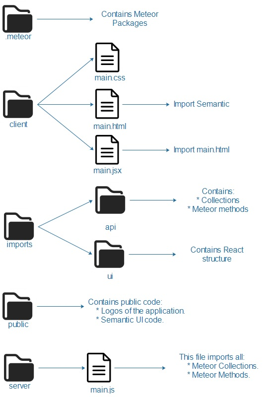
</p>

### Project Flow

<p align="center">
  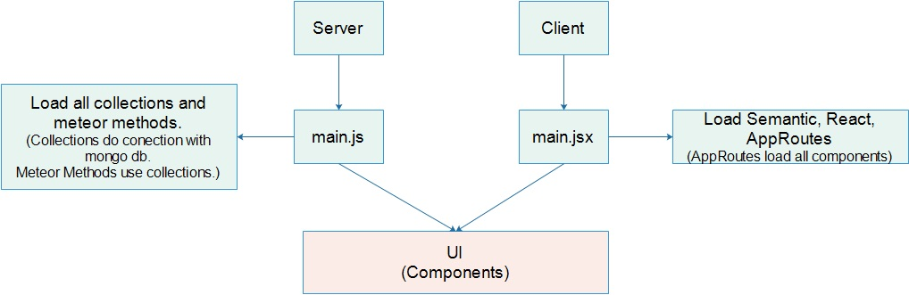
</p>

## UI

### Login

<p align="center">
  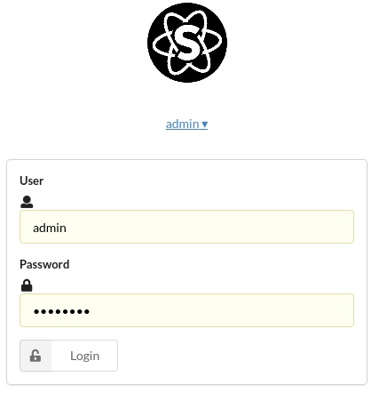
</p>
 
### Navigation bar

<p align="center">
  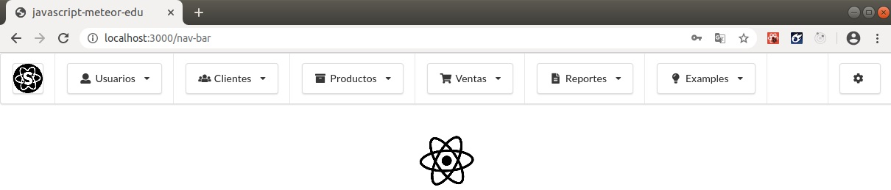
</p>

### Clients - Form

<p align="center">
  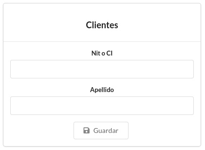
</p>

### Clients - Table

<p align="center">
  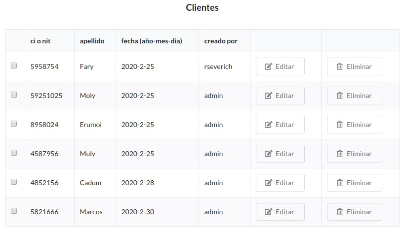
</p>

### Products - Form

<p align="center">
  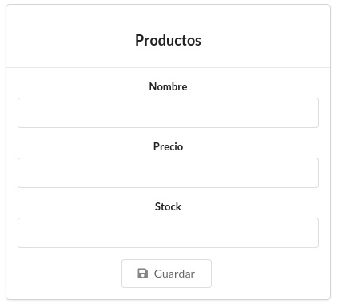
</p>

### Products - Table

<p align="center">
  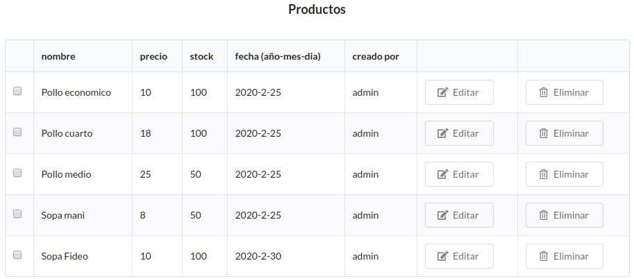
</p>

### Sales - Table

<p align="center">
  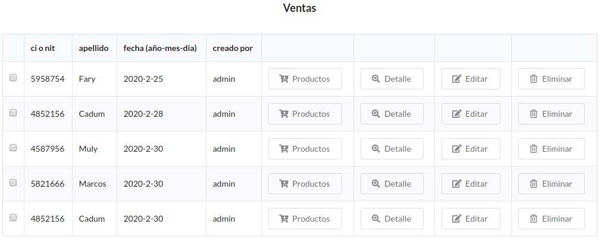
</p>

### Sales - Add productos

<p align="center">
  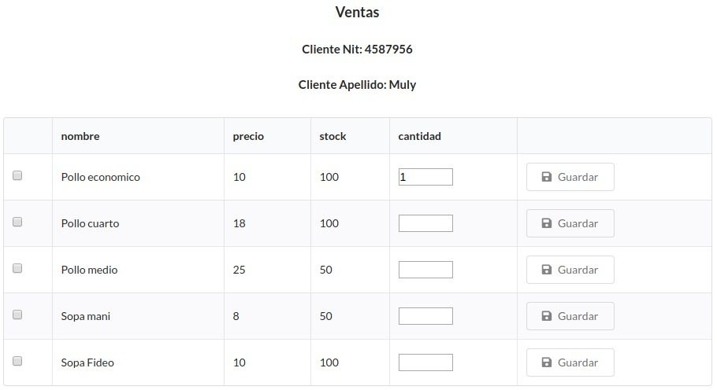
</p>
 
### Sales - Details

<p align="center">
  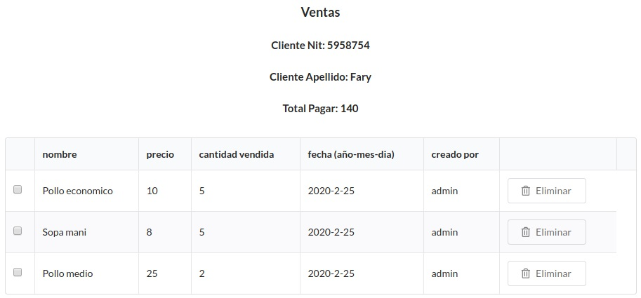
</p>
